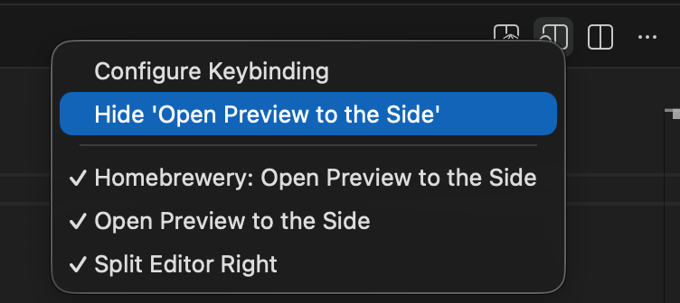
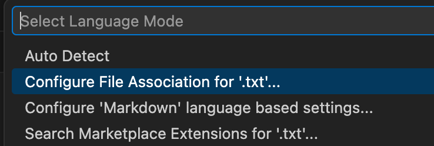

# Homebrewery for VS Code

Edit your favorite RPG content in your favorite editor.

This VS Code extension provides an editor for the [Homebrewery](https://homebrewery.naturalcrit.com/) content with completion snippets and a built-in live preview.

Inspired by some [related projects](#related-projects) which do not support the new elements and is no longer updated.

## Installation

Requires [Visual Studio Code](https://code.visualstudio.com/download). Once VSCode is installed, search for the extension or install it from [here](https://marketplace.visualstudio.com/items?itemName=fxnicolas.homebrewery4vsc).

## Features

This extension provides the following features:

* **Extended Markdown editor** to generate beautiful documents in the style of the Dungeons & Dragons books and resources.
* Snippets for the **Homebrewery syntax**.
* **Live Preview** with synchronized scrolling. Click in the preview to scroll the editor.
* **Generate HTML** for PDF printing.

### Editor

This extension enhances the default Markdown editor with:

* [Completion snippets](#snippets).
* Coloring for `metadata` and `css` fenced code blocs.
* Toolbar button named **Homebrewery: Open Preview to the Side**, with an alternate **Homebrewery: Open Preview** button.

### Snippets

Snippets provide access to the extended Markdown syntax implemented by Homebrewery. They can be accessed with `CTRL+Space` in Markdown documents. 

Homebrewery snippets start with `Homebrewery`.

Font icons provided in Homebrewery are also available as snippets. These start with `Font Icon`. 
**NOTE**: As these snippets can clutter the completion dropdown, you can disable them with the `homebrewery4vsc.enableFontIconCompletions` [setting](#extension-settings).

### Commands

From a markdown editor:

* **Homebrewery: Open Preview** opens a live preview.
* **Homebrewery: Open Preview to the Side** opens a preview to the side of the current editor.
* **Homebrewery: Generate HTML** generates a plain HTML file named after the markdown file. This file can be viewed and printed as PDF from a web browser.

From the preview:

* **Homebrewery: Change Layout to ...** switches the layout to single page, two pages and flow.
* **Homebrewery: Change Zoom In/Out Preview** zooms the preview.
* **Homebrewery: Reset Preview Zoom** resets the zoom.

### Preview and HTML Output

The live preview displays your markdown document as a Homebrewery rendering, with multiple page.
The Preview toolbar includes buttons to switch the layout and zoom in the preview.

Note that the preview automatically scrolls with the editor position. To scroll the editor to a specific page, click that page in the preview.

You can configure the preview behavior and HTML output in the [extension settings](#extension-settings).

## Extension Settings

This extension exposes the following settings:

* `homebrewery4vsc.enableFontIconCompletions`: Enable/disable the font icon completion snippers.
* `homebrewery4vsc.highlightColumnAndPageBreaks`: Highlight entire lines containing page and column breaks, for better editor readability.
* `homebrewery4vsc.scrollPreviewWithEditor`: Enable/disable preview scrolling with the editor.
* `homebrewery4vsc.theme`: The theme (Player's Hanbook, Dungeon Master's Guide, etc) used in preview and the HTML output.
* `homebrewery4vsc.customStyleSheets`: List of style sheets (CSS files within the workspace or accessed with HTTP) added to all documents when rendering.
* `homebrewery4vsc.pageFormat`: Preview and HTML output page format (A4 or Letter).
* `homebrewery4vsc.inlineLocalImages`: Inline local images in the HTML output. This creates standalone HTML files.
* `homebrewery4vsc.hideBackground`: Hide the background image and color in the preview or the HTML output, mainly for printing.

## Credits

This extension is inspired from the [**Dungeon and Markdown**](https://marketplace.visualstudio.com/items?itemName=SpjakSoftware.dungeonsandmarkdown) extension by Spjak Software (Jacob Olesen).

This extension uses the Themes, Icons and Markdown Renderer from [**The Homebrewery**](https://github.com/naturalcrit/homebrewery), under the MIT license.
The Homebrewery is copyright (c) 2016 Scott Tolksdorf. **Many thanks to the contributors who keep this project alive!**

## FAQ

### How to hide the default Markdown Preview button?

VS Code comes with a default markdown preview, which adds to the markdown editor's toolbar a button labelled *Open Preview to the Side*. To hide it from the toolbar, right-click the button and select *Hide 'Open Preview to the Side'*, as shown below. You can restore it later if needed.

### How to synchronize my workspace with the Homebrewery?

The Homebrewery provides a feature to synchronize your brews in your Google Drive Folder. For automated synchronization:

1. Create your brews in the Homebrewery, and activate the Google Drive synchronization there.
2. Add the **Google Drive > My Drive > Homebrewery** folder to the VS Code workspace.
3. Edit the text files generated in this folder by the Homebrewery.

Changes done in VS Code will appear in the Homebrewery and vice-versa.

### How to work with text (.txt) files?

When editing files in the Homebrewery, or downloading source files, you'll notice that these files have a `.txt` extension (and not `.md`).

VS Code recognize these files as markdown but as **Plain Text**. To have them associated to the Markdown syntax:

1. In the VS Code status bar (at the bottom of the window), click **Plain Text**.
2. In **Select Language Mode**, select **Configure File Association for `.txt`...** 

3. Finally, select **Markdown** .

## Known Issues

* No known issue

## Release Notes

### 1.0.0

Initial release of Homebrewery for VS Code.

### 1.1.0

- Optimized scrolling synchronization
- Preview lazy reload on markdown edits to prevent flickering effect

### 1.2.0

- Added page and column breaks highlighting in the markdown editor.

## Related Projects

- [Homebrewery](https://github.com/naturalcrit/homebrewery)
- [Dungeon and Markdown](https://marketplace.visualstudio.com/items?itemName=SpjakSoftware.dungeonsandmarkdown)
