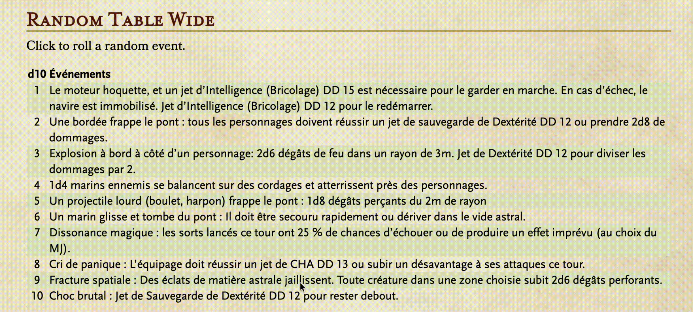
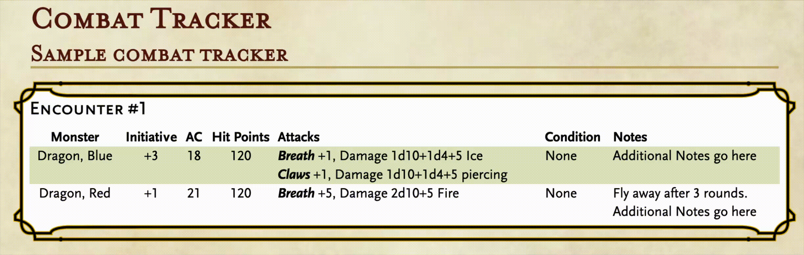
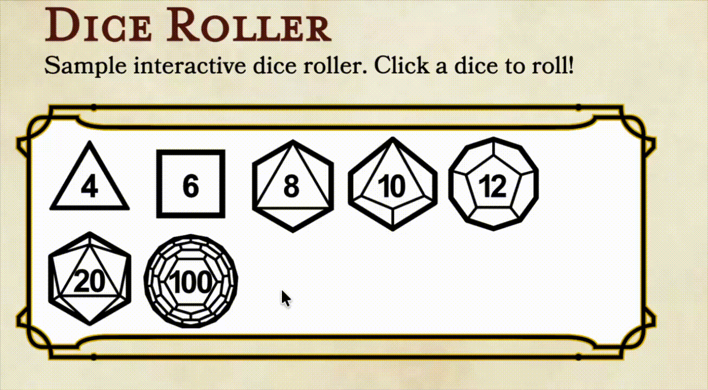
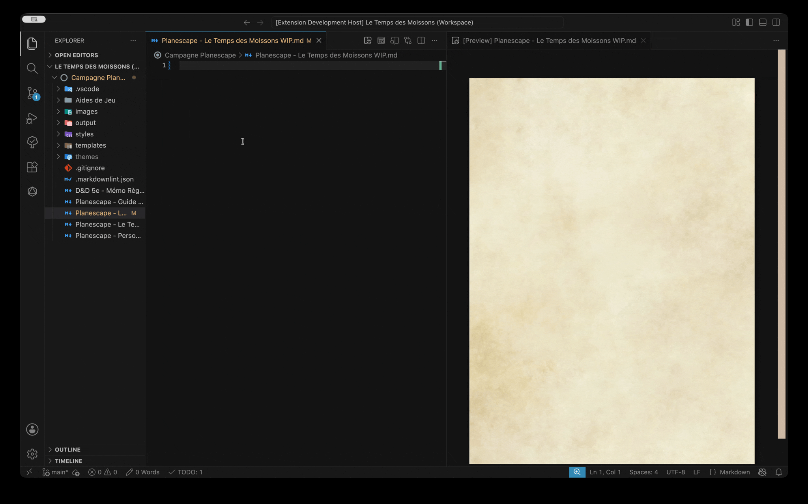
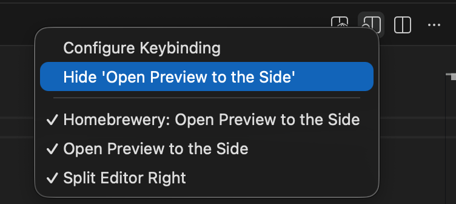
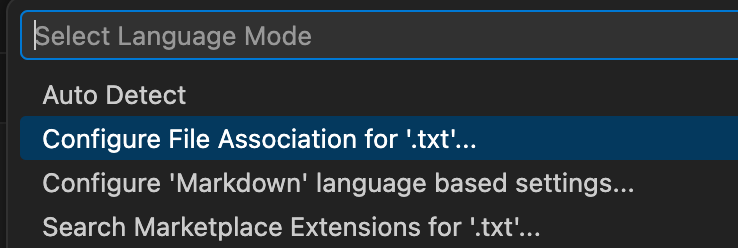

# Homebrewery for VS Code

Edit your favorite TTRPG content in your favorite editor.

This VS Code extension provides an editor for your TTRPG content (aka **Brews**) using Markdown syntax supported by [The Homebrewery](https://homebrewery.naturalcrit.com/).
It provides completion snippets and a built-in live preview.


It is inspired by some projects listed in [related projects](#related-projects).

## Installation

This extension requires [Visual Studio Code](https://code.visualstudio.com/download). Once VSCode is installed, search for the extension or install it from [the marketplace](https://marketplace.visualstudio.com/items?itemName=iffrit.homebrewery4vsc).

## Features

This extension provides the following features:

* **Extended Markdown editor** to generate beautiful documents in the style of the Dungeons & Dragons books and resources.
* Snippets for the **Homebrewery syntax**.
* **Live Preview** with synchronized scrolling.
* **Generate HTML** for PDF printing.
* Support for **File References and Includes**.
* **Interactive Components** to manage and save game sessions in your brews.
* **SRD 5e Reference View** listing classes, feats, magic items, monsters, spells, etc available in the *5e System Reference Document*.

### Editor

This extension enhances the default Markdown editor with:

* [Completion snippets](#snippets).
* Coloring for `metadata` and `css` fenced code blocs.
* Toolbar button named **Homebrewery: Open Preview to the Side**, with an alternate **Homebrewery: Open Preview** button.

### Snippets

Snippets provide access to the extended Markdown syntax implemented by Homebrewery. They can be accessed with `CTRL+Space` in Markdown documents.

Homebrewery snippets start with `Homebrewery`.

Font icons provided in Homebrewery are also available as snippets. These start with `Font Icon`.

**NOTE**: As Font icon snippets can clutter the completion dropdown, you can disable them with the `homebrewery4vsc.enableFontIconCompletions` [setting](#extension-settings).

### File References and Includes

References and includes make it easier to work with complex, multi-file brews.

#### References (Links)

Use the `[alias](url)` syntax to create a hyperlink to another brew. This is rendered as a standard link in the generated output, so you can link between chapters, sections, or even build entire multi-page websites out of your brews.

#### Includes

Use the `{HEADING_OFFSET=n}` syntax to embed the content of another brew directly into the current one at render time.

`HEADING_OFFSET` shifts the heading levels of the included file by `n` (e.g. with `HEADING_OFFSET=1`, a *Heading 1* in the included file becomes a *Heading 2* in the final output). This lets you write each chapter as an independent, self-contained file — starting its own headings from `# Heading 1` — while still assembling them into a single, consistently structured book.

For example, a main book file could look like:

```text
# Main Book

## Introduction

Lorem ipsum...

{HEADING_OFFSET=1}
{HEADING_OFFSET=1}
...
{HEADING_OFFSET=1}

## Conclusion

Lorem ipsum...
```

Note that:

* Only **local files** with an `.md` or `.txt` extension are supported for both links and includes.
* The Include syntax is only recognized when it appears **at the beginning of a line**.
* Includes are **recursive** — an included file can itself include further files, at any depth.
* `HEADING_OFFSET` applies cumulatively across recursive includes, so nested includes are offset by the sum of all levels above them.
* Metadata and CSS blocks are ignored in included files — only those in the main file are applied to the final output.

**⚠️ IMPORTANT:** Includes and References are only supported in Hombrewery for VS Code, and not in NaturaCrit's Homebrewery.

### Interactive Components

Use interactive components in your brews to create combat trackers, counters, rollable dice formulas, random tables, and more.

A brew containing interactive components, when exported to HTML, becomes a self-contained tool you can use to run and save your session state.

You can enable or disable interactive components entirely using the **Enable Interactive Components** setting.

**⚠️ IMPORTANT:** Interactive Components only work with Homebrewery for VS Code, and not in NaturalCrit's Homebrewery.
They are functional in the preview, in the HTML output, but not after prining to PDF.

#### Random Table

Insert a single markdown table inside an `{{hb-random-table }}` block to make it random. Click the table to randomly select a row.

```markdown
### Random Event Table

{{hb-random-table

|  d4   | Event   |
| :---: | :------ |
|   1   | Event 1 |
|   2   | Event 2 |
|   3   | Event 3 |
|   4   | Event 4 |

}}
```



You can style the highlighted row in a random table using the `.hb-row-selected` class.

#### Rollable Dice Formula

Use the `hb-roll` block class to create a *Rollable Dice Formula* visible in the brew (for example, *1d10+3*). Click the formula to roll the dice, and right-click to reset it back to the formula.

For example: `{{hb-roll 1d10+1d4+5}}` for a damage roll, or `{{hb-roll +5}}` for a d20+5 roll.

#### Counter

Use the `hb-counter` block to create a counter for hit points and more. For example: `{{hb-counter 120}}`. Click the counter to decrease its value, and right-click to increase it.

#### Condition

Use `{{hb-condition None}}` to create a status Condition component. Click the element to rotate through the SRD conditions.

#### Notes

Use `{{hb-notes Original notes text }}` to create an editable text note.

#### Save

Add the `hb-save` class to a counter, condition, or note to persist its value in the session state.
\
A toolbar automatically appears on the upper-right corner of the brew to load and save this state.

The example below illustrates how to build a simple encounter tracker using these components.

```markdown
### Simple Encounter Tracker

#### Small Blue Dragon

* **Initiative**: {{hb-roll +3}}
* **Hit Points**: {{hb-counter,hb-save 120}}
* **Attack**: Breath {{hb-roll +1}}, Damage {{hb-roll 1d10+1d4+5}} Piercing
* **Condition**: {{hb-condition,hb-save None}}
* **Notes**: {{hb-notes,hb-save Game notes }}
```



#### Rollable Dice

Add the `hb-rollable` class to dice from the icon fonts. Clicking the dice rolls it on screen.

```markdown
#### Sample interactive dice roller

Click a die to roll!

:df_d4_4:{hb-rollable,large}
:df_d6_6:{hb-rollable,large}
:df_d8_8:{hb-rollable,large}
:df_d10_10:{hb-rollable,large}
:df_d12_12:{hb-rollable,large}
:df_d20_20:{hb-rollable,large}
:df_d100_100:{hb-rollable,large}
```



### D&D 5e SRD Reference

A **Homebrewery** view container is added to the VS Code activity bar.

This container hosts a **SRD 5e Reference** tree view listing key elements of the *5e System Reference Document (SRD)*, such as classes, feats, magic items, monsters, spells, etc. This information is retrieved from the [D&D 5e SRD API](https://www.dnd5eapi.co/).

Clicking an item in the list adds its content to your brew.



**NOTE**: This API is <ins>partially</ins> localized in French and Portuguese (Brazil). Configure the language used to request information from this API using the `homebrewery4vsc.SRDLanguage` [setting](#extension-settings). This feature is experimental.

### Commands

From a markdown editor:

* **Homebrewery: Open Preview** opens a live preview.
* **Homebrewery: Open Preview to the Side** opens a preview to the side of the current editor.
* **Homebrewery: Generate HTML** generates a plain HTML file named after the brew file. This file can be viewed and printed as PDF from a web browser.

From the preview:

* **Homebrewery: Change Layout to ...** switches the layout to single page, two pages and flow.
* **Homebrewery: Change Zoom In/Out Preview** zooms the preview.
* **Homebrewery: Reset Preview Zoom** resets the zoom.
* **Homebrewery: Enable/Disable Synchronized Scroll** enables or disables the preview synchronization with the editor.
* **Homebrewery: Collapse/Expand Includes** to collapse/expand by default file includes.

### Preview and HTML Output

The live preview displays your markdown document as a Homebrewery rendering, with multiple page.
The Preview toolbar includes buttons to switch the layout and zoom in the preview.

Note that the preview automatically scrolls with the editor position. To scroll the editor to a specific page, click that page in the preview.

You can configure the preview behavior and HTML output in the [extension settings](#extension-settings).

### Themes

The extension includes the *5e Player's Handbook* , *5e Dungeon Master's Guide*, and *Journal* default themes from the Homebrewery.
Each brew can use a different theme, indicated in the `theme` property of the `metadata` fenced block within the brew file.
If no theme is declared in the brew, the default theme configured in the `homebrewery4vsc.theme` setting applies.

Example: A brew using the 5ePHB (*5e Player's Handbook*) default theme.

```yaml
    ```metadata
    title: The Vampire's Bride
    description: 'Test to use a well known style.'
    tags:
    - meta:Scenario
    systems:
    - 5e
    renderer: V3
    theme: 5ePHB
    ```

    The story starts here.
    ...
```

You can refer in the `theme` property to another brew from your workspace and use it as a *local theme*.\
This brew file should have:

* A `theme` property of the `metadata` fenced block, pointing to one of the default themes.
* A `css` fenced block containing the various styles that compose this theme.

Example: A brew referring to a `HB-StrahdStyle.txt` theme in the workspace.

```yaml
    ```metadata
    title: The Vampire's Bride
    description: 'Test to use a well known style.'
    tags:
    - meta:Scenario
    systems:
    - 5e
    renderer: V3
    theme: ./themes/HB-StrahdStyle.txt
    ```

    The story starts here.
    ...
```

The content of the `HB-StrahdStyle.txt`file. It uses the `5ePHB` base theme, and adds CSS on top of it.

```markdown
    ```metadata
    title: Strahd Style
    description: 'This is a theme file'
    tags:
    - meta:Theme
    systems:
    - 5e
    renderer: V3
    theme: 5ePHB
    ```

    ```css
    /* A lot of CSS here */

```

**💡 TIP**: A large set of awesome templates (designed by **@KaiburrKathHound**) are available from [The Homebrewery](https://homebrewery.naturalcrit.com/user/KaiburrKathHound?sort=created&dir=asc)

### CSS

In addition to the themes, the extension supports a `css`fenced block in a brew to define local styles.

You can also set in the `homebrewery4vsc.customStyleSheets` setting a list of css files that will apply to all your brews in the workspace.

## Extension Settings

This extension exposes the following settings:

* `homebrewery4vsc.enableFontIconCompletions`: Enable/disable the font icon completion snippers.
* `homebrewery4vsc.enableInteractiveComponents`: Enable/disable interactive components (counters, rollable formulas, etc).
* `homebrewery4vsc.highlightColumnAndPageBreaks`: Highlight entire lines containing page and column breaks, for better editor readability.
* `homebrewery4vsc.scrollPreviewWithEditor`: By default, keep the preview scrolled to match the corresponding position in the editor.
* `homebrewery4vsc.collapseIncludes`**`: By default, collapse/expand files embedded using the include syntax.
* `homebrewery4vsc.theme`: The theme (Player's Hanbook, Dungeon Master's Guide, etc) used in preview and the HTML output.
* `homebrewery4vsc.defaultLanguage`: Default Brew language. This converts into the HTML `lang` property, which affects hyphenation and spellchecking. You can also specify a `language` metadata element at brew level.
* `homebrewery4vsc.customStyleSheets`: List of style sheets (CSS files within the workspace or accessed with HTTP) added to all documents when rendering.
* `homebrewery4vsc.pageFormat`: Preview and HTML output page format (A4 or Letter).
* `homebrewery4vsc.inlineLocalImages`: Inline local images in the HTML output. This creates standalone HTML files.
* `homebrewery4vsc.hideBackground`: Hide the background image and color in the preview or the HTML output, mainly for printing.
* `homebrewery4vsc.SRDLanguage`: (Experimental) Localization used in the SRD 5e Reference.

## Credits

This extension is inspired from the [**Dungeon and Markdown**](https://marketplace.visualstudio.com/items?itemName=SpjakSoftware.dungeonsandmarkdown) extension by Spjak Software (Jacob Olesen).

This extension uses the Themes, Icons and Markdown Renderer from [**The Homebrewery**](https://github.com/naturalcrit/homebrewery), under the MIT license.
The Homebrewery is copyright (c) 2016 Scott Tolksdorf.\
**Many thanks to the contributors who keep this project alive!**

The *SRD 5e Reference View* uses [**Intrinsical's D&D 5e Icon Set**](https://github.com/intrinsical/tw-dnd/tree/main/icons) by David Kor Kian Wei under [Creative Commons Attribution-ShareAlike 4.0 International](https://creativecommons.org/licenses/by-sa/4.0/?ref=chooser-v1).

The *SRD 5e Reference View* uses code from the [**APItoHB**](https://github.com/G-Ambatte/APItoHB/tree/main) from G.Ambatte, under the MIT licence.

## FAQ

### How to hide the default Markdown Preview button?

VS Code comes with a default markdown preview, which adds to the markdown editor's toolbar a button labelled *Open Preview to the Side*. To hide it from the toolbar, right-click the button and select *Hide 'Open Preview to the Side'*, as shown below. You can restore it later if needed.



### How to synchronize my workspace with the Homebrewery?

The Homebrewery provides a feature to synchronize your brews in your Google Drive Folder. For automated synchronization:

1. Create your brews in the Homebrewery, and activate the Google Drive synchronization there.
2. Add the **Google Drive > My Drive > Homebrewery** folder to the VS Code workspace.
3. Edit the brew files generated in this folder by the Homebrewery.

Changes done in VS Code will appear in the Homebrewery and vice-versa.

### How to work with text (.txt) files?

When editing brews in the Homebrewery, or downloading sources, you'll notice that these files have a `.txt` extension (and not `.md`).

VS Code recognize these files as markdown but as **Plain Text**. To have them associated to the Markdown syntax:

1. In the VS Code status bar (at the bottom of the window), click **Plain Text**.
2. In **Select Language Mode**, select **Configure File Association for `.txt`...**\


3. Finally, select **Markdown** .

## Known Issues

* No known issue

## Related Projects

* [Homebrewery](https://github.com/naturalcrit/homebrewery)
* [Dungeon and Markdown](https://marketplace.visualstudio.com/items?itemName=SpjakSoftware.dungeonsandmarkdown)
* [DM Binder](https://marketplace.visualstudio.com/items?itemName=jpsnee.vscode-dmbinder)
* [Homebrewery Markdown Preview](https://marketplace.visualstudio.com/items?itemName=officerhalf.homebrewery-vscode)
